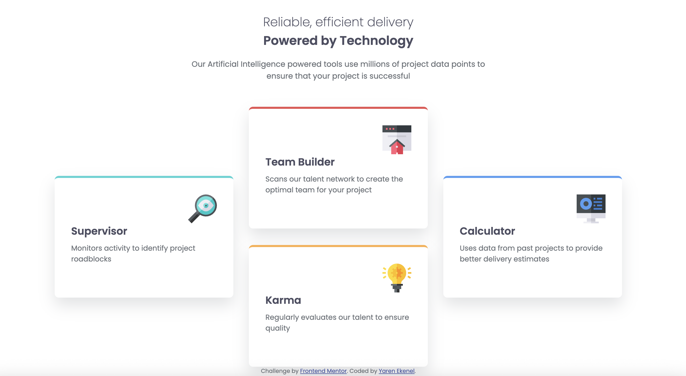

# Frontend Mentor - Four card feature section solution

This is a solution to the [Four card feature section challenge on Frontend Mentor](https://www.frontendmentor.io/challenges/four-card-feature-section-weK1eFYK). Frontend Mentor challenges help you improve your coding skills by building realistic projects.

## Table of contents

- [Overview](#overview)
  - [The challenge](#the-challenge)
  - [Screenshot](#screenshot)
  - [Links](#links)
- [My process](#my-process)
  - [Built with](#built-with)
  - [What I learned](#what-i-learned)
  - [Continued development](#continued-development)
- [Author](#author)

## Overview

### The challenge

Users should be able to:

- View the optimal layout for the site depending on their device's screen size

### Screenshot

### Links

- Solution URL: [GitHub Repository](https://github.com/yarenekenel/Four-Card-Feature-Section)
- Live Site URL: [Live Site](https://yarenekenel.github.io/Four-Card-Feature-Section/)

## My process

### Built with

- Semantic HTML5 markup
- CSS custom properties
- Flexbox
- CSS Grid
- Responsive design

### What I learned

While working on this project, I practiced arranging cards in a layout that changes between mobile and desktop screens. I learned how to use media queries to adapt the layout and how to style cards with colored top borders to match the design.

### Continued development

In future projects, I want to keep improving my layout skills with CSS Grid and Flexbox and write more accessible, semantic HTML.

## Author

- GitHub - [@yarenekenel](https://github.com/yarenekenel)
